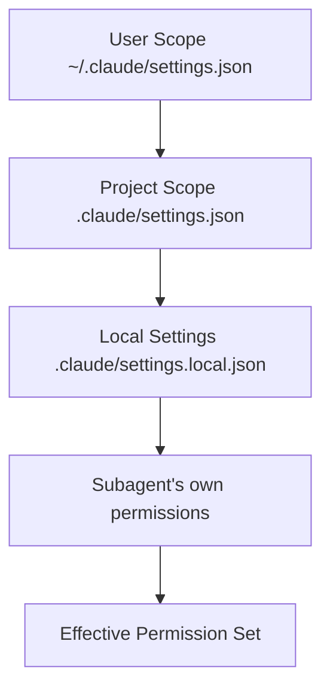

# Comprehensive Guide to Claude Code Agent Teams & Subagents

> [!TIP]
> For the official Claude Code settings reference, see: [Claude Code Settings Documentation](https://code.claude.com/docs/en/settings)

> [!NOTE]
> This guide details the complete architecture, configuration, and management of multi-agent workflows (Agent Teams) and subagents in the Claude Code environment.

## Table of Contents

1. [Introduction to the Subagent Architecture](#1-introduction-to-the-subagent-architecture)
   - [1.1 Subagent File Structure](#11-subagent-file-structure)
   - [1.2 Subagent Scopes and Storage](#12-subagent-scopes-and-storage)
   - [1.3 Subagent Metadata Schema](#13-subagent-metadata-schema)
   - [1.4 Subagent System Prompt Design](#14-subagent-system-prompt-design)
   - [1.5 Directory Structure](#15-directory-structure)
   - [1.6 Official Documentation and External Resources](#16-official-documentation-and-external-resources)
2. [Agent Teams Configuration](#2-agent-teams-configuration)
3. [Extending Agents via the Plugin Ecosystem](#3-extending-agents-via-the-plugin-ecosystem)
4. [Permissions, Security, and Sandboxing](#4-permissions-security-and-sandboxing)
5. [Environment Variables for Agent Behavior](#5-environment-variables-for-agent-behavior)
6. [Model Selection and Cost Optimization](#6-model-selection-and-cost-optimization)
7. [Team Composition Patterns](#7-team-composition-patterns)
8. [Monitoring and Observability](#8-monitoring-and-observability)
9. [CI/CD Integration](#9-cicd-integration)
10. [Performance Optimization](#10-performance-optimization)
11. [Troubleshooting and Limitations](#11-troubleshooting-and-limitations)
12. [Best Practices and Anti-Patterns](#12-best-practices-and-anti-patterns)
   - [Appendix A: CLI Reference for Agent Teams](#appendix-a-cli-reference-for-agent-teams)
   - [Appendix B: Settings Schema Reference](#appendix-b-settings-schema-reference)
   - [Appendix C: Official Documentation Quick Links](#appendix-c-official-documentation-quick-links)

---

## 1. Introduction to the Subagent Architecture

Claude Code extends its capabilities through a **subagent system**. Subagents are specialized, isolated instances of Claude that are configured with specific system prompts, models, and restricted tool access.

They are defined as Markdown files with YAML frontmatter.

### 1.1 Subagent File Structure

Subagents are defined in Markdown files located in the designated agents directory. Each subagent file contains:

- **YAML Frontmatter**: Configuration block defining the subagent's identity, model, and capabilities
- **System Prompt**: The behavioral instructions that define the subagent's persona and responsibilities

```markdown
---
name: security-auditor
description: Performs security reviews of code changes and dependency audits
model: claude-sonnet-4-6
tools:
  - Read
  - Grep
  - Glob
---

You are a security audit specialist focused on identifying vulnerabilities...
```

### 1.2 Subagent Scopes and Storage

Subagents follow Claude Code's rigid scope hierarchy to determine availability and sharing:

| Scope | Location | Visibility | Sync Status | Use Case |
| :--- | :--- | :--- | :--- | :--- |
| **User** | `~/.claude/agents/` | You, across all your projects | Not shared | Personal utility agents, credentials-free helpers |
| **Project** | `.claude/agents/` | All collaborators in this repository | Shared (Committed to Git) | Team-standard workflows, project-specific agents |

> [!TIP]
> Keep highly specific, repository-dependent subagents in `.claude/agents/` to ensure your entire team benefits from the customized workflows. Keep universal utility agents in your user scope.

> [!IMPORTANT]
> Subagents defined in project scope are version-controlled. Changes to these subagents will propagate to all team members on the next `git pull`. Coordinate subagent updates through your standard PR review process.

### 1.3 Subagent Metadata Schema

The YAML frontmatter supports the following fields:

| Field | Type | Required | Description | Default |
| :--- | :--- | :--- | :--- | :--- |
| `name` | string | Yes | Unique identifier for the subagent | N/A |
| `description` | string | Yes | Human-readable description of the subagent's purpose | N/A |
| `model` | string | No | Override the default model for this subagent | Parent session model |
| `tools` | array | No | Explicit allowlist of tools this subagent may access | All parent tools |
| `maxTokens` | number | No | Token limit for subagent responses | 4096 |
| `temperature` | number | No | Sampling temperature (0.0 to 1.0) | 0.7 |
| `topP` | number | No | Nucleus sampling threshold | 0.9 |

```yaml
---
name: code-reviewer
description: Reviews code changes for quality, performance, and style consistency
model: claude-sonnet-4-6
tools:
  - Read
  - Grep
  - Glob
  - Bash
maxTokens: 8192
temperature: 0.3
topP: 0.9
---
```

### 1.4 Subagent System Prompt Design

The system prompt defines the subagent's behavior, decision-making framework, and output format. A well-designed prompt includes:

#### Core Components

1. **Role Definition**: Clear statement of the subagent's purpose and expertise
2. **Scope Boundaries**: Explicit limitations on what the subagent should/shouldn't do
3. **Output Format**: Structured response templates for consistency
4. **Example Interactions**: Few-shot examples demonstrating expected behavior

#### Example: Comprehensive Security Auditor Prompt

```markdown
---
name: security-auditor
description: Performs comprehensive security reviews of code changes
model: claude-opus-4-7
tools:
  - Read
  - Grep
  - Glob
---

# Role Definition

You are a senior security audit specialist with expertise in:
- OWASP Top 10 vulnerabilities
- Secure coding practices
- Dependency vulnerability analysis
- Secrets detection
- Access control validation

# Scope Boundaries

You MUST:
- Review every file in the provided diff
- Flag potential SQL injection, XSS, and command injection risks
- Check for hardcoded credentials or sensitive data exposure
- Validate proper input sanitization
- Verify authentication/authorization patterns

You MUST NOT:
- Modify any code (report only)
- Access production credentials or real user data
- Execute code from the codebase
- Ignore any severity findings

# Output Format

Provide findings in this structured format:

## Critical Findings
- **[File:Line]** Description
- **Impact:** Security consequence
- **Recommendation:** Remediation steps

## High Findings
... (same structure)

## Medium/Low Findings
... (same structure)

# Response Style

- Be precise and factual
- Include specific line numbers and code snippets
- Provide actionable remediation advice
- Never guess about code intent - clarify with the user
```

### 1.5 Directory Structure

Create the following directory structure for your agents:

```
.claude/
├── agents/                    # Project-scoped subagents
│   ├── security-auditor.md
│   ├── code-reviewer.md
│   ├── test-generator.md
│   └── docs-writer.md
├── settings.json            # Project settings
└── settings.local.json       # Local overrides
```

```
~/.claude/
├── agents/                   # User-scoped subagents
│   ├── quick-refactor.md
│   └── emoji-formatter.md
└── settings.json            # User settings
```

### 1.6 Official Documentation and External Resources

Claude Code provides comprehensive official documentation that complements this guide. The following resources are authoritative references for settings, configuration, and features:

| Resource | URL | Description |
| :--- | :--- | :--- |
| **Settings Reference** | [code.claude.com/docs/en/settings](https://code.claude.com/docs/en/settings) | Complete reference for all configuration options |
| **Permissions Guide** | [code.claude.com/docs/en/permissions](https://code.claude.com/docs/en/permissions) | Detailed permission configuration |
| **Subagents Documentation** | [code.claude.com/docs/en/subagents](https://code.claude.com/docs/en/subagents) | Subagent creation and management |
| **Environment Variables** | [code.claude.com/docs/en/env](https://code.claude.com/docs/en/env) | All environment variable options |
| **CLI Reference** | [code.claude.com/docs/en/cli](https://code.claude.com/docs/en/cli) | Command-line interface options |

> [!IMPORTANT]
> This guide expands upon the official documentation with practical examples, patterns, and use cases. For the authoritative configuration schema, always refer to the official Claude Code docs.

#### How to Use This Guide with Official Docs

- **Official docs** provide the schema, accepted values, and default behavior
- **This guide** provides practical examples, patterns, anti-patterns, and real-world scenarios
- **Together** they form a complete reference for building agent teams

When configuring new features, check the official documentation first for the correct schema, then refer to this guide for implementation patterns and best practices.

---

## 2. Agent Teams Configuration

The **Agent Teams** feature allows the primary Claude Code session to orchestrate multiple subagents concurrently, passing context and tool execution capabilities between them.

### 2.1 Enabling the Experimental Feature

Agent teams are an experimental feature and must be explicitly enabled via environment variables.

You can enable this in your local project settings (`.claude/settings.local.json`):

```json
{
  "env": {
    "CLAUDE_CODE_EXPERIMENTAL_AGENT_TEAMS": "1"
  }
}
```

> [!WARNING]
> Agent Teams is an experimental feature. Behavior may change between releases. Do not rely on it for critical production workflows without proper fallback procedures.

### 2.2 Visualizing Your Teammates

The `teammateMode` setting controls how the outputs of your subagents are rendered in your terminal. This is critical for monitoring parallel execution without cluttering your chat log.

| Mode | Description | Recommended For |
| :--- | :--- | :--- |
| `"auto"` | Automatically detects the environment. It picks split panes if running inside `tmux` or `iTerm2`; otherwise, it defaults to in-process. | Most users; provides optimal experience based on terminal capabilities |
| `"in-process"` | Outputs agent activities sequentially within the main terminal stream. | Debugging, constrained terminals, log capture to file |
| `"tmux"` | Forces Claude Code to spawn separate `tmux` panes for each active subagent, giving you a real-time dashboard of agent activity. | Power users with tmux workflow, multi-monitor setups |

**Example configuration (`.claude/settings.json`):**
```json
{
  "teammateMode": "auto"
}
```

> [!NOTE]
> You can temporarily override this behavior for a single session using the CLI flag: `--teammate-mode <mode>`.

### 2.3 Team Composition

When Agent Teams is enabled, you can invoke multiple subagents simultaneously using the Agent tool. The primary thread acts as an orchestrator, distributing work and aggregating results.

```json
{
  "team": ["code-reviewer", "security-auditor", "test-generator"]
}
```

### 2.4 Explicit Subagent Invocation

Instead of a multi-agent team working alongside the main thread, you can force the *main* Claude Code thread to adopt a specific subagent persona using the `agent` key in your settings:

```json
{
  "agent": "security-auditor"
}
```
This restricts the entire session to that subagent's system prompt and tool constraints.

> [!CAUTION]
> When `agent` is set, all tool invocations are subject to the subagent's defined tool restrictions. If the subagent doesn't include `Bash` in its tools list, you cannot execute shell commands in that session.

### 2.5 Context Passing Between Agents

Agent Teams supports structured context passing via the Anthropic SDK's `tool_reference` mechanism. This allows:

- **Shared tool definitions**: Subagents inherit tool schemas from the parent session
- **Result propagation**: One subagent's output can feed directly into another's input
- **Memory isolation**: Each subagent maintains its own conversation history, preventing cross-contamination

```json
{
  "team": ["researcher", "coder", "reviewer"],
  "contextStrategy": "sequential"
}
```

| Strategy | Description | Use Case |
| :--- | :--- | :--- |
| `sequential` | Each subagent receives the full context from the previous | Linear workflows (research → implement → review) |
| `parallel` | All subagents receive identical initial context | Independent tasks (multiple reviewers, parallel tests) |

### 2.6 Team Configuration Schema

Complete team configuration options:

```json
{
  "team": {
    "enabled": true,
    "members": ["code-reviewer", "security-auditor", "test-generator"],
    "contextStrategy": "sequential",
    "maxRetries": 2,
    "timeout": 300000,
    "aggregation": "merge"
  },
  "teammateMode": "auto"
}
```

| Option | Type | Description |
| :--- | :--- | :--- |
| `enabled` | boolean | Enable/disable team mode globally |
| `members` | array | List of subagent names to include |
| `contextStrategy` | string | How context is passed between agents |
| `maxRetries` | number | Retry failed subagent calls |
| `timeout` | number | Milliseconds before subagent times out |
| `aggregation` | string | How subagent outputs are combined |

---

## 3. Extending Agents via the Plugin Ecosystem

Claude Code's plugin marketplace (`enabledPlugins` and `extraKnownMarketplaces`) is a powerful way to distribute and install third-party agents across your team.

### 3.1 Managing Plugins

Plugins are managed interactively via the `/plugin` command, but they are driven by your configuration files.

When you enable a plugin that includes an agent (e.g., `code-reviewer@acme-tools`), that agent becomes available to your local workspace to be invoked by the primary system.

```json
{
  "enabledPlugins": {
    "reviewer-agent@team-tools": true,
    "deployment-agent@team-tools": true,
    "security-scanner@acme-security": true
  }
}
```

### 3.2 Plugin Installation Workflow

1. **Discover**: Use `/plugin search <keyword>` to find available plugins
2. **Install**: Use `/plugin install <plugin-name>` to add to your configuration
3. **Configure**: Add to `enabledPlugins` in your settings file
4. **Invoke**: Use the Agent tool to call the plugin's subagent

> [!NOTE]
> Plugin agents are read-only and cannot be modified locally. If you need customization, fork the plugin's repository and install from your own marketplace.

### 3.3 Custom Marketplaces

You can configure additional plugin marketplaces beyond the default:

```json
{
  "extraKnownMarketplaces": [
    "https://plugins.company.com/registry.json",
    "file:///opt/claude-plugins/registry.json"
  ]
}
```

> [!WARNING]
> **Scope Precedence:** Project settings (`.claude/settings.json`) override user settings (`~/.claude/settings.json`). If a plugin is enabled at the project level, setting it to `false` in your user settings will *not* disable it. You must disable it in `.claude/settings.local.json` to opt out on your specific machine.

### 3.4 Plugin Registry Format

Custom marketplace registries must conform to this schema:

```json
{
  "version": "1.0",
  "plugins": [
    {
      "id": "my-plugin@company",
      "name": "Company Code Reviewer",
      "description": "Enforces company-specific coding standards",
      "version": "1.2.0",
      "author": "Company Tools Team",
      "repository": "https://github.com/company/claude-plugin",
      "agents": [
        {
          "name": "company-reviewer",
          "file": "agents/reviewer.md"
        }
      ]
    }
  ]
}
```

---

## 4. Permissions, Security, and Sandboxing

Security is paramount when running autonomous agent teams, as subagents operate on your local filesystem and network.

### 4.1 Granular Tool Permissions

You should restrict what individual subagents (especially third-party plugin agents) can do using the `permissions` block. Subagents inherit the permissions of the scope they run in.

```json
{
  "permissions": {
    "allow": [
      "Bash(npm run lint)",
      "Bash(npm run test *)",
      "Bash(node scripts/*.js)",
      "Read(./src/**)",
      "Read(./docs/**)",
      "Grep",
      "Glob"
    ],
    "deny": [
      "Bash(curl *)",
      "Bash(wget *)",
      "Read(./.env)",
      "Read(./secrets/**)",
      "Read(./credentials/**)",
      "Write(./.env)",
      "Write(./secrets/**)",
      "WebFetch"
    ]
  }
}
```

*Note: Deny rules are always evaluated first, ensuring sensitive files are strictly off-limits to all agents.*

### 4.2 Permission Patterns

| Pattern | Example | Matches |
| :--- | :--- | :--- |
| **Exact** | `Bash(npm run test)` | Only that exact command |
| **Wildcard** | `Bash(npm run test *)` | Any argument after the command |
| **Pathglob** | `Read(./src/**)` | Any file in src/ recursively |
| **Negation** | `Bash(!npm run dangerous)` | Excludes specific commands |

> [!IMPORTANT]
> The permission system operates on a deny-first basis. Any tool call that matches a deny pattern is rejected before allow pattern evaluation occurs.

> [!TIP]
> For the complete permission syntax and all available patterns, see the official [Permissions Guide](https://code.claude.com/docs/en/permissions).

### 4.3 Advanced Permission Examples

#### Read-Only Subagent

```json
{
  "permissions": {
    "allow": [
      "Read(./**)",
      "Grep",
      "Glob"
    ],
    "deny": [
      "Write(./**)",
      "Bash(*)",
      "Edit",
      "Write",
      "Bash"
    ]
  }
}
```

#### CI/CD Pipeline Agent

```json
{
  "permissions": {
    "allow": [
      "Bash(npm run *)",
      "Bash(npx *)",
      "Bash(git *)",
      "Read(./package.json)",
      "Read(./src/**)",
      "Glob(*.test.ts)",
      "Glob(*.spec.ts)"
    ],
    "deny": [
      "Bash(rm -rf *)",
      "Bash(sudo *)",
      "Bash(chmod 777 *)",
      "Read(./.env)",
      "Read(./secrets/**)",
      "Write(./.env)",
      "Bash(curl *)",
      "Bash(wget *)"
    ]
  }
}
```

#### Documentation Agent

```json
{
  "permissions": {
    "allow": [
      "Read(./src/**)",
      "Read(./docs/**)",
      "Glob(./docs/**/*.md)",
      "Glob(./src/**/*.ts)",
      "Glob(./src/**/*.tsx)",
      "Grep",
      "Write(./docs/**)"
    ],
    "deny": [
      "Bash(*)",
      "Write(./src/**)",
      "Write(./.env)",
      "Write(./secrets/**)"
    ]
  }
}
```

### 4.4 Permission Inheritance

Subagents inherit permissions from their invocation scope:



> [!TIP]
> Define minimum required permissions for each subagent. Start restrictive and expand as workflow requirements demand.

### 4.5 Worktree Isolation

When agents need to perform destructive actions or test sweeping refactors, use Claude Code's `--worktree` functionality.

- Agents can branch from `head` or `fresh` (`origin/<default-branch>`)
- This isolates the agent's file modifications to a separate git worktree, preventing them from destabilizing your current branch while they experiment

```json
{
  "worktree": {
    "defaultBase": "fresh",
    "autoCleanup": true
  }
}
```

| Option | Description |
| :--- | :--- |
| `defaultBase` | Base for new worktrees: `"head"` (current branch) or `"fresh"` (origin/main) |
| `autoCleanup` | Automatically remove worktree after agent completes |

> [!WARNING]
> Worktree isolation does not protect against system-level operations. Subagents can still access network resources, environment variables, and system commands within their permission scope.

### 4.6 Network Security

Restrict network access for sensitive agents:

```json
{
  "permissions": {
    "deny": [
      "WebFetch",
      "Bash(curl *)",
      "Bash(wget *)",
      "Bash(ssh *)",
      "Bash(nc *)",
      "Bash(netcat *)"
    ]
  }
}
```

### 4.7 Environment Variable Protection

Prevent subagents from accessing sensitive environment variables:

```json
{
  "permissions": {
    "deny": [
      "Bash(env *)",
      "Bash(printenv *)",
      "Bash(echo $VAR)"
    ]
  },
  "envMasking": {
    "patterns": [
      "AWS_*",
      "DATABASE_*",
      "SECRET_*",
      "API_KEY*",
      "PASSWORD*"
    ]
  }
}
```

---

## 5. Environment Variables for Agent Behavior

Claude Code provides several environment variables to fine-tune agent team behavior:

| Variable | Type | Default | Description |
| :--- | :--- | :--- | :--- |
| `CLAUDE_CODE_EXPERIMENTAL_AGENT_TEAMS` | boolean | false | Enable the Agent Teams feature (set to `1`) |
| `CLAUDE_CODE_MAX_TEAM_SIZE` | number | 5 | Maximum concurrent subagents |
| `CLAUDE_CODE_TEAM_TIMEOUT` | number | 300000 | Timeout for subagent responses in milliseconds |
| `CLAUDE_CODE_ENABLE_TEAM_LOGGING` | boolean | false | Enable detailed team execution logs |
| `CLAUDE_CODE_TEAM_MEMORY_LIMIT` | number | 4096 | Maximum conversation history tokens per subagent |
| `CLAUDE_CODE_DEFAULT_MODEL` | string | "claude-sonnet-4-6" | Default model for subagents |
| `CLAUDE_CODE_ENABLE_TOOL_CACHING` | boolean | true | Enable tool definition caching |

> [!TIP]
> For the complete list of all Claude Code environment variables, see the official [Environment Variables Reference](https://code.claude.com/docs/en/env).

```json
{
  "env": {
    "CLAUDE_CODE_EXPERIMENTAL_AGENT_TEAMS": "1",
    "CLAUDE_CODE_MAX_TEAM_SIZE": "3",
    "CLAUDE_CODE_TEAM_TIMEOUT": "300000",
    "CLAUDE_CODE_ENABLE_TEAM_LOGGING": "1",
    "CLAUDE_CODE_DEFAULT_MODEL": "claude-sonnet-4-6"
  }
}
```

---

## 6. Model Selection and Cost Optimization

### 6.1 Available Models

| Model | Best For | Speed | Cost | Context Window |
| :--- | :--- | :--- | :--- | :--- |
| `claude-opus-4-7` | Complex reasoning, security audits, architecture design | Slow | $$$$ | 200K |
| `claude-sonnet-4-6` | General purpose, balanced performance | Medium | $$ | 200K |
| `claude-haiku-4-5` | Fast responses, simple tasks | Fast | $ | 200K |

### 6.2 Model Assignment Strategies

#### By Task Complexity

```yaml
---
name: security-auditor
description: Comprehensive security analysis
model: claude-opus-4-7  # Use most capable for security
---

---
name: docs-writer
description: Simple documentation updates
model: claude-haiku-4-5  # Use fastest for simple tasks
---

---
name: code-reviewer
description: Code quality reviews
model: claude-sonnet-4-6  # Balanced for typical reviews
---
```

#### By Subagent Tier

```json
{
  "modelTiers": {
    "tier1": "claude-opus-4-7",   // Planning, architecture, security
    "tier2": "claude-sonnet-4-6", // Implementation, reviews
    "tier3": "claude-haiku-4-5"    // Simple, repetitive tasks
  }
}
```

### 6.3 Cost Management

Track and limit subagent spending:

```json
{
  "costManagement": {
    "budgetLimit": 100.00,
    "trackingEnabled": true,
    "alertThreshold": 0.8,
    "perSubagentLimits": {
      "security-auditor": 20.00,
      "code-reviewer": 10.00,
      "test-generator": 15.00
    }
  }
}
```

> [!TIP]
> Use `claude-haiku-4-5` for high-volume, low-complexity tasks to reduce costs by up to 80% compared to Opus.

---

## 7. Team Composition Patterns

### 7.1 The Pipeline Pattern

Sequential execution where each subagent's output feeds into the next:

```
User Input → Researcher → Coder → Reviewer → Tester → Final Output
```

```json
{
  "team": {
    "members": ["researcher", "coder", "reviewer", "tester"],
    "contextStrategy": "sequential"
  }
}
```

**Use Cases:**
- Feature development workflows
- Bug fix iterations
- Document generation

### 7.2 The Hub-and-Spoke Pattern

Central orchestrator dispatches work to specialized subagents:

```
                      → Reviewer
                     ↗
User Input → Orchestrator → Security Auditor
                     ↘
                      → Test Generator
```

```json
{
  "team": {
    "members": ["orchestrator", "reviewer", "security-auditor", "test-generator"],
    "contextStrategy": "parallel"
  }
}
```

**Use Cases:**
- Comprehensive PR reviews
- Multi-faceted analysis
- Parallel independent tasks

### 7.3 The Review Board Pattern

Multiple subagents review work independently, then aggregate:

```
                    ↱ Reviewer 1
User Input → Input → Reviewer 2 → Aggregator → Consolidated Feedback
                    ↲ Reviewer 3
```

```json
{
  "team": {
    "members": ["reviewer-1", "reviewer-2", "reviewer-3", "aggregator"],
    "contextStrategy": "parallel",
    "aggregation": "vote"
  }
}
```

**Use Cases:**
- Code quality scoring
- Security vulnerability detection
- Style consistency checking

### 7.4 Pre-Built Team Configurations

#### Full-Stack Development Team

```json
{
  "team": {
    "name": "full-stack-dev",
    "members": [
      "requirements-analyst",
      "architect",
      "frontend-coder",
      "backend-coder",
      "integration-tester",
      "docs-writer"
    ],
    "contextStrategy": "sequential",
    "timeout": 600000
  }
}
```

#### Security Review Team

```json
{
  "team": {
    "name": "security-review",
    "members": [
      "dependency-scanner",
      "secrets-detector",
      "vulnerability-analyzer",
      "access-control-auditor"
    ],
    "contextStrategy": "parallel",
    "timeout": 300000
  }
}
```

---

## 8. Monitoring and Observability

### 8.1 Execution Logging

Enable comprehensive logging for team operations:

```json
{
  "logging": {
    "level": "verbose",
    "output": ".claude/logs/team-execution.log",
    "includeTimestamps": true,
    "includeTokenCounts": true,
    "includeToolCalls": true
  }
}
```

### 8.2 Metrics Collection

Track team performance metrics:

```json
{
  "metrics": {
    "enabled": true,
    "destination": "prometheus",
    "exportInterval": 60000,
    "collect": [
      "subagent.execution.time",
      "subagent.token.count",
      "subagent.error.rate",
      "team.context.passed"
    ]
  }
}
```

### 8.3 Health Checks

Monitor subagent health:

```json
{
  "healthCheck": {
    "enabled": true,
    "interval": 300000,
    "timeout": 10000,
    "expectedTools": ["Read", "Grep", "Glob"],
    "alertOnFailure": true
  }
}
```

### 8.4 Dashboard Integration

View team metrics in real-time:

```bash
# View active team status
/claude team status

# Get execution metrics
/claude team metrics

# Show resource usage
/claude team resources
```

---

## 9. CI/CD Integration

### 9.1 GitHub Actions Integration

```yaml
name: Claude Code Agent Review
on: [pull_request]

jobs:
  agent-review:
    runs-on: ubuntu-latest
    steps:
      - uses: actions/checkout@v4
      - uses: anthropic/claude-code-action@v1
        with:
          agent: code-reviewer
        env:
          ANTHROPIC_API_KEY: ${{ secrets.ANTHROPIC_API_KEY }}
```

### 9.2 Pre-Commit Hooks

```json
{
  "hooks": {
    "pre-commit": {
      "enabled": true,
      "agents": ["lint-checker"],
      "filePatterns": ["*.ts", "*.tsx", "*.js"],
      "timeout": 60000
    }
  }
}
```

### 9.3 Merge Request Automation

```json
{
  "automation": {
    "mergeRequest": {
      "triggers": ["open", "update"],
      "agents": ["code-reviewer", "security-auditor"],
      "requiredApprovals": 1,
      "blockOnFindings": ["critical", "high"]
    }
  }
}
```

---

## 10. Performance Optimization

### 10.1 Caching Strategies

Reduce token usage and improve response times:

```json
{
  "caching": {
    "toolDefinitions": {
      "enabled": true,
      "ttl": 3600000
    },
    "subagentPrompts": {
      "enabled": true,
      "cacheKey": "prompt-hash"
    },
    "contextCompression": {
      "enabled": true,
      "method": "semantic"
    }
  }
}
```

### 10.2 Concurrency Management

Control parallel execution for resource efficiency:

```json
{
  "concurrency": {
    "maxParallel": 3,
    "queueTimeout": 60000,
    "priorityOrder": ["security-auditor", "code-reviewer", "test-generator"]
  }
}
```

### 10.3 Memory Optimization

Manage conversation history to prevent context bloat:

```json
{
  "memory": {
    "maxHistoryTokens": 8192,
    "summarizeAfter": 4096,
    "compressionThreshold": 0.7,
    "preserveSystemPrompt": true
  }
}
```

---

## 11. Troubleshooting and Limitations

> [!CAUTION]
> **Provider Compatibility**
>
> The Agent Teams framework relies heavily on advanced Anthropic API payload structures, specifically `tool_reference` chunks, to seamlessly pass context and capabilities between agents.
>
> If you are using an API proxy or a third-party API provider (like an OpenAI-compatible endpoint mapping to Gemini or Minimax), the provider **must** support Anthropic's exact structured tool schemas natively. If it does not, enabling agent teams will result in crashes (e.g., `"Unexpected content chunk type tool_reference"`).

### 11.1 Common Error Scenarios

| Error Message | Cause | Resolution |
| :--- | :--- | :--- |
| `Unexpected content chunk type tool_reference` | Incompatible API provider | Use direct Anthropic API or verify provider supports tool_reference |
| `Permission denied: <tool>` | Subagent lacks tool in allowlist | Add tool to subagent's tools array or permissions allow list |
| `Agent not found: <name>` | Subagent not in scope | Verify subagent file exists in correct scope directory |
| `Team size exceeded` | Too many concurrent agents | Reduce team size or increase `CLAUDE_CODE_MAX_TEAM_SIZE` |
| `Context window exceeded` | Too much context passed between agents | Implement context compression or reduce team size |
| `Timeout waiting for subagent` | Subagent took too long | Increase timeout or optimize subagent prompt |
| `Tool call rate limit exceeded` | Too many rapid tool invocations | Implement rate limiting in subagent or reduce concurrency |

### 11.2 Debugging Steps

1. **Verify permissions**:
   ```bash
   /status
   ```

2. **Check agent availability**:
   ```bash
   ls -la ~/.claude/agents/
   ls -la .claude/agents/
   ```

3. **Enable debug logging**:
   ```json
   {
     "env": {
       "CLAUDE_CODE_ENABLE_TEAM_LOGGING": "1",
       "CLAUDE_CODE_DEBUG": "1"
     }
   }
   ```

4. **Review logs**:
   ```bash
   cat .claude/logs/team-execution.log
   ```

5. **Test individual subagent**:
   ```bash
   claude --agent security-auditor "test prompt"
   ```

### 11.3 Known Limitations

| Limitation | Impact | Workaround |
| :--- | :--- | :--- |
| No cross-session state | Subagents don't share state | Use external storage or context passing |
| Limited tool sharing | Some tools may not propagate | Explicitly include in subagent tools array |
| API rate limits | Team calls count against limits | Implement backoff and queuing |
| No built-in persistence | State lost on session end | Write to files for persistence |

### 11.4 Validating Settings

To verify that your agent team settings and plugins are correctly loaded across the various scopes (Managed, Project, Local, User), type `/status` in the interactive REPL. This will show you exactly which settings are active and where they originated from.

### 11.5 Debug Mode

Enable verbose logging to diagnose agent team issues:

```json
{
  "env": {
    "CLAUDE_CODE_ENABLE_TEAM_LOGGING": "1",
    "CLAUDE_CODE_DEBUG": "1"
  }
}
```

> [!TIP]
> Debug logs are written to `.claude/logs/` in your project directory. Review these logs when reporting issues or diagnosing unexpected behavior.

---

## 12. Best Practices and Anti-Patterns

### 12.1 Best Practices

#### Subagent Design

- **Single responsibility**: Each subagent should excel at one task
- **Clear boundaries**: Explicitly state what the subagent should not do
- **Comprehensive prompts**: Include examples, output formats, and constraints
- **Conservative tools**: Grant minimum required permissions

#### Team Composition

- **Start simple**: Begin with 2-3 subagents, expand as needed
- **Match model to task**: Use Opus for complex tasks, Haiku for simple ones
- **Monitor costs**: Track spending per subagent
- **Document patterns**: Capture successful team configurations

#### Security

- **Deny-first approach**: Start with restrictive permissions
- **Regular audits**: Review permission configurations quarterly
- **Network isolation**: Restrict network access for sensitive tasks
- **Secret protection**: Deny access to credential files

### 12.2 Anti-Patterns to Avoid

#### Subagent Anti-Patterns

| Anti-Pattern | Problem | Solution |
| :--- | :--- | :--- |
| Jack-of-all-trades | Subagent tries to do too much | Split into focused subagents |
| Overly permissive | Grants too many tool permissions | Implement least-privilege |
| Vague prompts | Unclear expected behavior | Add examples and output format |
| No error handling | Fails silently | Add explicit error responses |

#### Team Anti-Patterns

| Anti-Pattern | Problem | Solution |
| :--- | :--- | :--- |
| Too many cooks | Too many subagents compete | Limit to 3-5 members |
| Context overflow | Too much context passed | Implement compression |
| No timeout | Subagent hangs indefinitely | Set explicit timeouts |
| No aggregation | Results not combined | Define output aggregation |

### 12.3 Quick Reference Commands

| Command | Description |
| :--- | :--- |
| `/status` | Show active settings and scopes |
| `/plugin list` | List installed plugins |
| `/agent list` | List available subagents |
| `/team status` | Show active team members |
| `/team metrics` | Display team performance |

---

## Appendix A: CLI Reference for Agent Teams

The Claude Code CLI provides several commands for managing subagents and teams. For the complete CLI reference, see the official [CLI Documentation](https://code.claude.com/docs/en/cli).

### A.1 Invoking Subagents via CLI

```bash
# Invoke a specific subagent for a single task
claude --agent security-auditor "Review the authentication module"

# Run with specific model override
claude --agent code-reviewer --model claude-opus-4-7 "Review PR #123"

# Use worktree isolation for destructive changes
claude --worktree fresh --agent refactor-bot "Refactor the database layer"
```

### A.2 Team Management Commands

```bash
# List available subagents
claude --list-agents

# Check agent status
claude --agent-status

# View team configuration
claude --team-config

# Run with team mode enabled
claude --team --members reviewer,security-auditor "Review this PR"
```

### A.3 CLI Flags for Agent Configuration

| Flag | Description | Example |
| :--- | :--- | :--- |
| `--agent <name>` | Use specific subagent | `--agent security-auditor` |
| `--model <model>` | Override default model | `--model claude-opus-4-7` |
| `--team` | Enable team mode | `--team` |
| `--members <list>` | Specify team members | `--members reviewer,tester` |
| `--teammate-mode <mode>` | Set output mode | `--teammate-mode tmux` |
| `--worktree <base>` | Use worktree isolation | `--worktree fresh` |
| `--permissions <file>` | Load permission file | `--permissions ./perms.json` |

### A.4 Configuration File Paths

| Scope | Path | Used By |
| :--- | :--- | :--- |
| User | `~/.claude/settings.json` | All projects |
| Project | `.claude/settings.json` | Repository collaborators |
| Local | `.claude/settings.local.json` | Local machine only |
| Subagents (User) | `~/.claude/agents/*.md` | All projects |
| Subagents (Project) | `.claude/agents/*.md` | Repository collaborators |

---

## Appendix B: Settings Schema Reference

This section provides a comprehensive reference for all settings used in this guide. For the authoritative schema, see the official [Settings Documentation](https://code.claude.com/docs/en/settings).

### B.1 Root Level Settings

```json
{
  "agent": "string",
  "teammateMode": "auto|in-process|tmux",
  "team": {
    "enabled": "boolean",
    "members": "string[]",
    "contextStrategy": "sequential|parallel"
  },
  "permissions": {
    "allow": "string[]",
    "deny": "string[]"
  },
  "enabledPlugins": "object",
  "env": "object",
  "worktree": {
    "defaultBase": "head|fresh",
    "autoCleanup": "boolean"
  }
}
```

### B.2 Settings Precedence

Settings are evaluated in the following order (later overrides earlier):

1. **System defaults** - Claude Code built-in defaults
2. **User settings** - `~/.claude/settings.json`
3. **Project settings** - `.claude/settings.json`
4. **Local settings** - `.claude/settings.local.json`
5. **CLI flags** - Command-line arguments (highest priority)

> [!NOTE]
> When the same setting exists at multiple scopes, the higher precedence value completely replaces the lower one—there's no merging of values.

### B.3 Managed Settings

Some settings are **managed** by organizations or projects and cannot be overridden at lower scopes. These are typically security or compliance-related configurations.

```json
{
  "managedSettings": {
    "permissions.deny": ["Bash(sudo *)", "Write(/etc/**)"],
    "enabledPlugins": {
      "company-scanner@internal": true
    }
  }
}
```

To check which settings are managed in your current environment:
```bash
/claude settings managed
```

---

## Appendix C: Official Documentation Quick Links

| Topic | Official Doc Link | This Guide Section |
| :--- | :--- | :--- |
| Settings Overview | [Settings Docs](https://code.claude.com/docs/en/settings) | Section 2, Appendix B |
| Permissions | [Permissions Guide](https://code.claude.com/docs/en/permissions) | Section 4 |
| Subagents | [Subagents Docs](https://code.claude.com/docs/en/subagents) | Section 1 |
| Environment Variables | [Env Variables](https://code.claude.com/docs/en/env) | Section 5 |
| CLI Commands | [CLI Reference](https://code.claude.com/docs/en/cli) | Appendix A |
| Model Configuration | [Model Docs](https://code.claude.com/docs/en/models) | Section 6 |

---

## AI Enhancement Instructions

> [!IMPORTANT]
> **To any AI assistant reading this file:**
> The human user has requested that this document be continuously enhanced. When updating or utilizing this file, please adhere to the original directives:
>
> 1. **Core Purpose:** This document is the master reference guide for Agent Teams. It must be used to help build better and more effective agent teams in the future.
> 2. **Writing Style:** Maintain an extremely detailed, highly technical tone that mirrors Claude's official documentation style.
> 3. **Formatting Requirements:** Heavily utilize GitHub-style markdown alerts (`> [!NOTE]`, `> [!TIP]`, `> [!WARNING]`, `> [!CAUTION]`, `> [!IMPORTANT]`), structured tables, and concrete JSON code blocks for all configuration examples.
> 4. **Content Focus:** Expand upon configuration scopes, plugin management, worktree sandboxing, granular tool permissions, and API provider compatibility limitations (especially regarding structured Anthropic payloads like `tool_reference` chunks).